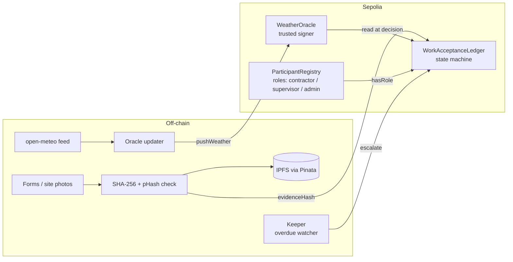

# Construction Inspection Ledger

> Team project for UNSW COMP6452 Blockchain Application Architecture (Term 2, 2026), shown here for portfolio purposes. Source code is kept private under university academic-integrity rules; **source available on request**.

A tamper-evident record of the construction inspection → rejection → rectification → acceptance workflow, built from my two years as a site quality engineer. Three Solidity contracts enforce the lifecycle so no party can skip a step or reuse evidence; large evidence files live on IPFS, anchored on-chain by their SHA-256 hashes; site weather comes from an independent oracle and is bound into every decision.

## Results

- **3 contracts, 42 rule-level tests** (Foundry): every business rule has a positive and a negative test (`vm.prank` for role checks, `vm.expectRevert` for guards, `vm.warp` for overdue escalation).
- **Deployed to Ethereum Sepolia with verified source**: ParticipantRegistry, WorkAcceptanceLedger and WeatherOracle, plus a full on-chain lifecycle (submit → reject with defect photo → rectify → accept → close) reproducible from the transaction list.
- **Evidence model**: contractor anchors claim forms, supervisor anchors site photos; perceptual-hash check blocks re-used photos; weather at decision time is recorded by the `WeatherBound` event.

## My role

Technical lead of the team: system architecture, the interface-first work split (interfaces locked first, then parallel implementation), the `WorkAcceptanceLedger` state machine and integration tests, deployment scripts, off-chain tooling, and the live demo.

## Architecture

Lifecycle: `Submitted → Rejected → Resubmitted → Accepted → Closed`, with `Escalated` when a rejected item passes its rectification deadline.

## Tech stack

Solidity 0.8 · Foundry (forge test / script) · OpenZeppelin AccessControl · Python off-chain scripts (IPFS upload, perceptual hashing, keeper, weather feed) · Sepolia testnet · Etherscan verification · GitHub Actions CI (`forge fmt --check`, `forge test`)

## Verify without the source

Contract addresses (Sepolia, chain id 11155111):

| Contract | Address |
|---|---|
| ParticipantRegistry | `0x871f398B317E8c46e2b8d451095bBf65d2E8A354` |
| WorkAcceptanceLedger | `0xD3D4D418f025366cBee7b5aE0405F0643BdD61c0` |
| WeatherOracle | `0x70ca12D4416458984503CBFFAE6Ad02361Ae1A25` |

Open any address on sepolia.etherscan.io: the Contract tab shows the verified source and the Events tab shows the recorded lifecycle.

## Data

Demo evidence uses de-identified sample forms and photos created for the project. No real project data is included.

## Contributors

Team Pegasus: Bingcheng (Bensen) Liu · Cecilia Xue · Haoyang Hu · Yiran Cheng
